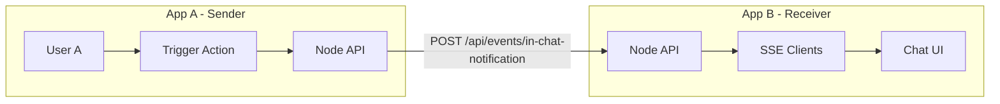

# Cross-App In-Chat Notification Plan

Port the notification mechanism to enable App A (sender) to trigger an in-chat message in App B (receiver). Ultra-minimal implementation: HTTP POST from App A to App B, SSE broadcast in App B, append assistant message to chat. Testable via curl on both sides.

## Prerequisites

| Prerequisite | Description |
|--------------|--------------|
| **Same codebase structure** | Both projects use the e2e-chatbot-app-next layout: Node API (Express), React frontend, `useChat` from Vercel AI SDK, `Chat` component with `setMessages` |
| **Same workspace** | Both apps run in the same Databricks workspace, same PAT, same permissions (ISO setup) |
| **Network reachability** | App A's backend can HTTP POST to App B's Node API URL |
| **User identification** | App B needs a stable `user_id` for SSE subscription (e.g. from role, session, or env) |

## Single Codebase, Two Roles

You implement both sender and receiver in the **same codebase**. Configure via env vars:

| Role | Env vars | Behavior |
|------|----------|----------|
| Sender | `NOTIFY_TARGET_URL` set | Can POST to another app's endpoint |
| Receiver | `VITE_NOTIFY_USER_ID` set | Subscribes to SSE and appends in-chat messages |

For local testing, run **two instances** of the same app on different ports (see Local Testing Setup below).

## Architecture



**Flow:**

1. User A triggers action in App A (e.g. via agent tool or test endpoint)
2. App A POSTs `{ target_user_id, text }` to `{NOTIFY_TARGET_URL}/api/events/in-chat-notification`
3. App B's Node receives, broadcasts to SSE clients subscribed with matching `user_id`
4. App B's frontend receives event, calls `setMessages(prev => [...prev, newAssistantMessage])`

## Shared Contract

| Item | Value |
|------|-------|
| POST path | `/api/events/in-chat-notification` |
| POST body | `{ target_user_id: string, text: string }` |
| SSE path | `GET /api/events/in-chat-notifications?user_id={id}` |
| SSE event | `{ type: 'in_chat_notification', text: string }` |

## Local Testing Setup

- **Instance 1 (sender):** Node on 3001, frontend on 3000 (default). Env: `NOTIFY_TARGET_URL=http://localhost:3003`
- **Instance 2 (receiver):** Node on 3003, frontend on 3002 (vite config override). Env: `VITE_NOTIFY_USER_ID=test-user`

---

## Prompt A: Implement Sender (App A)

Add cross-app in-chat notification SENDER to this project.

**Goal:** When an action is triggered, POST to another app's endpoint so that app can show an in-chat message to a target user.

**Implementation (ultra minimal):**

1. **Node API** – Add endpoint `POST /api/trigger-notify`:
   - Body: `{ target_user_id: string, text: string }`
   - Reads `NOTIFY_TARGET_URL` from env (required when this endpoint is used)
   - Forwards: `POST {NOTIFY_TARGET_URL}/api/events/in-chat-notification` with same body
   - Returns 204 on success, or appropriate error if NOTIFY_TARGET_URL unset or POST fails

2. **Env** – Document `NOTIFY_TARGET_URL`: base URL of the receiver app's Node API (e.g. `http://localhost:3003` for local, or deployed app URL)

**Test:** With NOTIFY_TARGET_URL set and App B running:

```bash
curl -X POST http://localhost:3001/api/trigger-notify \
  -H "Content-Type: application/json" \
  -d '{"target_user_id":"test-user","text":"Hello from App A"}'
```

Expect: 204. App B (with VITE_NOTIFY_USER_ID=test-user) should show the message in chat.

---

## Prompt B: Implement Receiver (App B)

Add cross-app in-chat notification RECEIVER to this project.

**Goal:** Receive notification from another app and append an assistant message to the current chat.

**Implementation (ultra minimal):**

1. **Node API** – Add two endpoints in server (e.g. in index.ts, near existing task-events if present):
   - `GET /api/events/in-chat-notifications?user_id={id}` – SSE endpoint:
     - Store clients: `{ res: Response, userId?: string }`
     - On connect, push client; on close, remove
     - Optional heartbeat every 30s
   - `POST /api/events/in-chat-notification` – Receive from sender:
     - Body: `{ target_user_id: string, text: string }`
     - Broadcast `{ type: 'in_chat_notification', text }` to clients where `userId` matches `target_user_id` or client has no filter

2. **Frontend** – Add `useInChatNotification` hook:
   - Params: `(userId: string | null, setMessages: (fn: (prev) => Message[]) => void)`
   - When `userId` is set: subscribe to `GET /api/events/in-chat-notifications?user_id={userId}` via EventSource
   - On `in_chat_notification`: append `{ id: generateUUID(), role: 'assistant', parts: [{ type: 'text', text }], metadata: { createdAt: new Date().toISOString() } }` using `setMessages(prev => [...prev, newMsg])`
   - Reconnect on error (e.g. 3s delay)

3. **Wire in Chat** – In the Chat component (where `useChat` provides `messages` and `setMessages`):
   - Get `userId` from `import.meta.env.VITE_NOTIFY_USER_ID` or a config/context
   - Call `useInChatNotification(userId ?? null, setMessages)` so notifications append to current chat

4. **Env** – Document `VITE_NOTIFY_USER_ID`: when set, the frontend subscribes to in-chat notifications for this user (e.g. `test-user` for local testing)

**Test:** With VITE_NOTIFY_USER_ID=test-user, open chat. From another terminal:

```bash
curl -X POST http://localhost:3003/api/events/in-chat-notification \
  -H "Content-Type: application/json" \
  -d '{"target_user_id":"test-user","text":"Test notification"}'
```

Expect: A new assistant message "Test notification" appears in the chat.

---

## File References (Current Project)

| Purpose | Path |
|---------|------|
| Node API, task-events pattern | `e2e-chatbot-app-next/server/src/index.ts` (lines 137–192) |
| SSE client pattern | `e2e-chatbot-app-next/client/src/hooks/useTaskEvents.ts` |
| Append message pattern | `e2e-chatbot-app-next/client/src/components/chat.tsx` (lines 291–306, `showStaffingDutyOnly`) |
| Chat component, setMessages | `e2e-chatbot-app-next/client/src/components/chat.tsx` |
| generateUUID | `e2e-chatbot-app-next/client/src/lib/utils.ts` or `@chat-template/core` |

---

## Out of Scope (This Iteration)

- Agent tool integration (can be added later; use `/api/trigger-notify` for testing)
- Authentication on the notification endpoint
- Persistence of notifications across page reloads
- Toast or other UI beyond in-chat message
